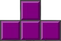

<!-- PROJECT LOGO -->
 

  

<h1 align="center">Battle Tetris</h1>

  

     A multiplayer puzzle game, where you face off against opponents in the classic game of Tetris with a twist...
     
     
    <a href="#getting-started">Play the Game!</a>
  

<!-- TABLE OF CONTENTS -->

  
Table of Contents

  <ol>
    <li>
      <a href="#about-the-project">About The Project</a>
      <ul>
        <li><a href="#built-with">Built With</a></li>
      </ul>
    </li>
    <li>
      <a href="#getting-started">Getting Started</a>
      <ul>
        <li><a href="#prerequisites">Prerequisites</a></li>
        <li><a href="#setup">Setup</a></li>
      </ul>
    </li>
    <li><a href="#how-to-play-🎮">How to play</a></li>
    <li><a href="#license">License</a></li>
    <li><a href="#contact">Contact</a></li>
    <li><a href="#acknowledgments">Acknowledgments</a></li>
  </ol>

   

<!-- ABOUT THE PROJECT -->
# About The Project

![Game screenshot with 4 players][product-screenshot]

This is the last project in the JS module of kood/Jõhvi, where we got to choose a game to make!  
The aim of the exercise was to create a multiplayer game, where the gameplay had interactivity between the players. I will admit that we were a bit strapped for time, so we decided to choose a tighter scope for the project. So, drawing inspiration from games like Tetris 99 and the website tetr.io, we created Battle Tetris. The entire project took about 2 weeks.

### The game

The game is similar to Tetris, in that you have a board with a grid, where you drop pieces and if a line is filled, it disappears and you get points. However, upon clearing 2 or more lines, you send garbage lines to a random opponent, which are filled lines with a single block missing. So, whoever can clear the most lines, with emphasis on clearing multiple lines at once, wins!  
The controls are similar to most other Tetris games, except there is no hold, where you store a block for later use.  
The game features 2 game modes:  
* Multiplayer, where you face off against other human players
* Singleplayer, where you battle it out with bots of varying difficulty

### Built With

*  (backend)
*  (home and lobby pages)
*  (game logic)

(<a href="#readme-top">back to top</a>)

<!-- GETTING STARTED -->
## Getting Started

### Prerequisites

* npm
* ngrok (if you wish to play with others, make sure you have an account setup for ngrok. If not, create an account at https://dashboard.ngrok.com/signup)

### Setup

1. Clone the repository using:

        https://gitea.kood.tech/robertpirs/web-game.git

1.  Open a terminal
2.  Navigate to the client directory
3.  Run the following commands:

        npm i
        npm run build

4.  Navigate to the server directory
5.  Create a `.env` file inside the server directory and add the following content inside it:

        PORT=4000
        NGROK=true
        NGROK_AUTHTOKEN=<your-auth-token>

6.  Run the following commands:

        npm i
        npm start

## How to play 🎮

After running npm start, you should see a message like this in the terminal:

    Ingress established at: https://bf87-146-255-182-177.ngrok-free.app

Open the website in your browser using the link provided by the terminal.  
Instructions on how to create/join a game are listed on the website.  
Have fun :)

### Contributors:

<!-- LICENSE -->
## License

Distributed under the MIT License. See `LICENSE.txt` for more information.

(<a href="#readme-top">back to top</a>)

<!-- CONTACT -->
## Contact

[![LinkedIn][linkedin-shield]][linkedin-url]

Skye Hakomaa - skyehakomaa@gmail.com

My itch.io: [https://anotherskye.itch.io](https://anotherskye.itch.io)

(<a href="#readme-top">back to top</a>)

<!-- ACKNOWLEDGMENTS -->
## Acknowledgments

* [Robert Pirs](https://github.com/rpirs123) - Co-developer

(<a href="#readme-top">back to top</a>)

<!-- MARKDOWN LINKS & IMAGES -->
<!-- https://www.markdownguide.org/basic-syntax/#reference-style-links -->
[product-screenshot]: README_images/battle-tetris_banner.png
[linkedin-shield]: https://custom-icon-badges.demolab.com/badge/LinkedIn-0A66C2?logo=linkedin-white&logoColor=fff
[linkedin-url]: https://www.linkedin.com/in/skye-hakomaa-0k0/
